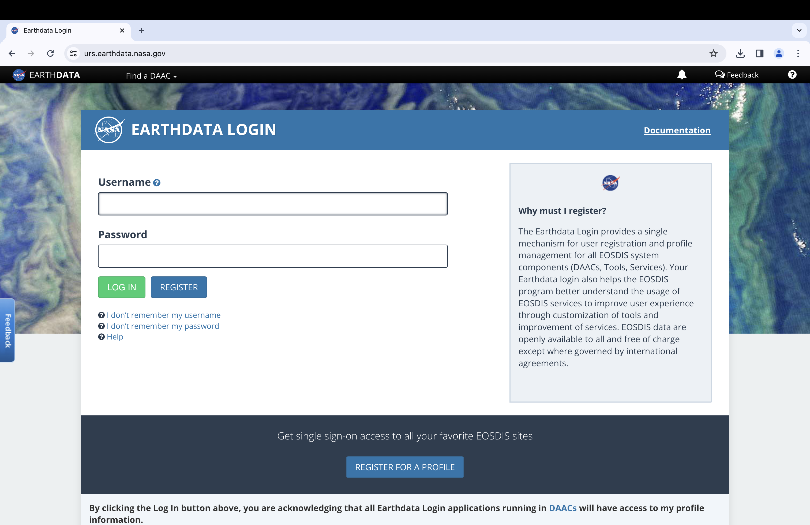

# Protected Data Sources

The `download_data` function from `amadeus` provides access to a variety
of publicly available environmental data sources. Although publicly
available, certain data sources are protected and require users to
provide login credentials before accessing and downloading the data.
Datasets from the National Aeronautics and Space Administration (NASA),
for example, require users to have and provide credentials for a NASA
EarthData account. Manually downloading data from the web while logged
into a NASA EarthData Account will automatically reference the user’s
credentials, but accessing data via the `download_data` function
requires “prerequiste files” which store user credentials.

## Motivation

This vignette will demonstrate how to create and log into a NASA
EarthData Account, and how to generate the prerequisite files with R
code.

## NASA EarthData Account

Visit <https://urs.earthdata.nasa.gov/> to register for or log into a
NASA EarthData account.



NASA EarthData Account Landing Page

Account registration provides access to NASA’s Earth Observing System
Data and Information System (EOSDIS) and its twelve Distributed Active
Archive Centers (DAAC), including:

- Alaska Satellite Facility (ASF) DAAC
- Atmospheric Science Data Center (ASDC)
- Crustal Dynamics Data Information System (CDDIS)
- Global Hydrometeorology Resource Center (GHRC)
- Goddard Earth Sciences Data and Information Services Center (GES DISC)
- Land Processes DAAC (LP DAAC)
- Level 1 and Atmosphere Archive and Distribution System (LAADS) DAAC
- National Snow and Ice Data Center (NSIDC) DAAC
- Oak Ridge National Laboratory (ORNL) DAAC
- Ocean Biology DAAC (OB.DAAC)
- Physical Oceanography DAAC (PO.DAAC)
- Socioeconomic Data and Applications Center (SEDAC)

See <https://www.earthdata.nasa.gov/eosdis/daacs> for more information.

### Approved applications

After creating an account, navigate to “My
Profile”(<https://urs.earthdata.nasa.gov/profile>), and then to
“Applications \> Authorized Apps”. This “Authorized Apps” page specifies
which NASA EarthData applications can use your login credentials. For
this example, ensure that authorization is enabled for “SEDAC Website”,
“SEDAC Website (Alpha)”, and “SEDAC Website (Beta)”.


NASA EarthData Approved Applications

## Prerequisite files

With a NASA EarthData Account and the required applications authorized
to use the credentials, it is time to create the prerequisite files. The
following examples will utilize the [UN WPP-Adjusted population density
data from NASA Socioeconomic Data and Applications Center
(SEDAC)](https://sedac.ciesin.columbia.edu/data/collection/gpw-v4/united-nations-adjusted).

Before generating the prerequisite, try to download the population data
with `download_data`.

``` r
download_data(
  dataset_name = "sedac_population",
  year = "2020",
  data_format = "GeoTIFF",
  data_resolution = "60 minute",
  directory_to_save = "./sedac_population",
  acknowledgement = TRUE,
  download = TRUE,
  unzip = TRUE,
  remove_zip = FALSE,
  remove_command = TRUE
)
```

    ## Downloading requested files...
    ## Requested files have been downloaded.
    ## Unzipping files...
    ## 
    ## Warning in unzip(file_name, exdir = directory_to_unzip): error 1 in extracting from zip file
    ## 
    ## Files unzipped and saved in ./sedac_population/.

As the error message indicates, the downloaded file cannot be unzipped
because the data file was not accessed properly. To be able to download
protected NASA data with `download_data`, the `.netrc`, `.urs_cookies`,
and `.dodsrc` must be generated.

**Note** The following code has been adopted from [How to Generate
Earthdata Prerequisite
Files](https://disc.gsfc.nasa.gov/information/howto?title=How%20to%20Generate%20Earthdata%20Prerequisite%20Files)
on NASA GES DISC’s [“How-To’s”
webpage](https://disc.gsfc.nasa.gov/information/howto).

**The folowing steps assume a Mac or Linux operating system.
Instructions for generating prerequisite files on Windows operating
system in R is being developed.**

### `.netrc`

The following commands create the `.netrc` file, which contains your
NASA EarthData Account credentials.

First, set your working directory to the home directory.

``` r
setwd("~/")
```

Create a file named `.netrc` with `file.create`.

``` r
file.create(".netrc")
```

Open a connection to `.netrc` with `sink`. Write the line
`machine urs...` replacing `YOUR_USERNAME` and `YOUR_PASSWORD` with your
NASA EarthData username and password, respectively. After writing the
line, close the connection with `sink` again.

``` r
sink(".netrc")
writeLines(
  "machine urs.earthdata.nasa.gov login YOUR_USERNAME password YOUR_PASSWORD"
)
sink()
```

Edit the settings so only you, the owner of the file, can read and write
`.netrc`.

``` r
system("chmod 0600 .netrc")
```

After, check to ensure the file was created properly.

``` r
file.exists(".netrc")
```

    ## [1] TRUE

``` r
readLines(".netrc")
```

    ## [1] "machine urs.earthdata.nasa.gov login YOUR_USERNAME password YOUR_PASSWORD"

### `.urs_cookies`

The following commands create the `.urs_cookies` file.

First, set your working directory to the home directory.

``` r
setwd("~/")
```

Create a file named `.netrc` with `file.create`.

``` r
file.create(".urs_cookies")
```

After, check to ensure the file was created properly.

``` r
file.exists(".urs_cookies")
```

    ## [1] TRUE

### `.dodsrc`

The following commands create the `.urs_cookies` file.

First, set your working directory to the home directory.

``` r
setwd("~/")
```

Create a file named “.dodsrc” with `file.create`.

``` r
file.create(".dodsrc")
```

Open a connection to `.dodsrc` with `sink`. Write the lines beginning
with `HTTP.`, replacing `YOUR_USERNAME` and `YOUR_PASSWORD` with your
NASA EarthData username and password, respectively. After writing the
line, close the connection with `sink` again.

``` r
sink(".dodsrc")
writeLines(
  paste0(
    "HTTP.NETRC=YOUR_HOME_DIRECTORY/.netrc\n",
    "HTTP.COOKIE.JAR=YOUR_HOME_DIRECTORY/.urs_cookies"
  )
)
sink()
```

After, check to ensure the file was created properly.

``` r
file.exists(".dodsrc")
```

    ## [1] TRUE

``` r
readLines(".dodsrc")
```

    ## [1] "HTTP.NETRC=YOUR_HOME_DIRECTORY/.netrc"           
    ## [2] "HTTP.COOKIE.JAR=YOUR_HOME_DIRECTORY/.urs_cookies"

It is important to ensure that these commands, as well as your username,
password, and home directory, are typed without error, as a single
problem with any of these files will result in a failed download. If the
files have been created correctly, the UN WPP-Adjusted population
density data from NASA Socioeconomic Data and Applications Center
(SEDAC) will be downloaded and unzipped without returning an error.

``` r
download_data(
  dataset_name = "sedac_population",
  year = "2020",
  data_format = "GeoTIFF",
  data_resolution = "60 minute",
  directory_to_save = "./sedac_population",
  acknowledgement = TRUE,
  download = TRUE,
  unzip = TRUE,
  remove_zip = FALSE,
  remove_command = TRUE
)
```

    ## Downloading requested files...
    ## Requested files have been downloaded.
    ## Unzipping files...
    ## Files unzipped and saved in ./sedac_population/.

Check the downloaded data files.

``` r
list.files("./sedac_population")
```

    ## [1] "gpw_v4_population_density_adjusted_to_2015_unwpp_country_totals_rev11_2020_1_deg_tif_readme.txt"
    ## [2] "gpw_v4_population_density_adjusted_to_2015_unwpp_country_totals_rev11_2020_1_deg_tif.zip"       
    ## [3] "gpw_v4_population_density_adjusted_to_2015_unwpp_country_totals_rev11_2020_1_deg.tif"

As indicated by the files in `./sedac_population`, the data files have
been downloaded properly.

## References

- EOSDIS Distributed Active Archive Centers (DAAC). *National
  Aeronautics and Space Administration (NASA)*. Date accessed: January
  3, 2024.
  [https://www.earthdata.nasa.gov/eosdis/daacs](https://niehs.github.io/amadeus/articles/).
- How to Generate Earthdata Prerequisite Files. *National Aeronautics
  and Space Administration (NASA)*. Date accessed: January 3, 2024.
  [https://disc.gsfc.nasa.gov/information/howto?title=How%20to%20Generate%20Earthdata%20Prerequisite%20Files](https://niehs.github.io/amadeus/articles/).
