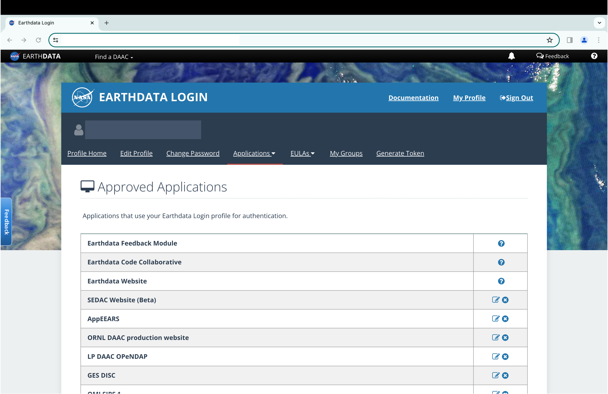

```{r, echo = FALSE, warning = FALSE, message = FALSE}
# packages
library(knitr)
library(testthat)
# source functions
sapply(
  list.files(
    "../R/",
    pattern = "download",
    full.names = TRUE
  ),
  source
)
```

## Motivation

The `data_download()` function was developed to improve researchers' access to publicly available geospatial data sets. Although the data are already available online, using a web browser to manually download hundreds or thousands of data files is slow, arduous, and not (efficiently) repeatable. Additionally, as users may not be familiar with creating download recipes in Bash (Unix shell), `data_download()` allows researchers to download data directly with R, a common coding language in the field of environmental health research. Finally, function-izing data downloads is useful for repeated code or automated analysis pipelines.

## data_download()

`data_download()` is capable of accessing and downloading geospatial data sets, collections, and variables from a variety of sources. This wrapper function calls on source-specific data download functions, each utilizing a unique combination of input parameters, host URL, naming convention, and data formats.

```{r, echo = FALSE}
functions <- c(
  "download_aqs_data", "download_ecoregion_data",
  "download_geos_cf_data", "download_gmted_data",
  "download_koppen_geiger_data", "download_merra2_data",
  "download_narr_monolevel_data", "download_narr_p_levels_data",
  "download_nlcd_data", "download_noaa_hms_smoke_data",
  "download_sedac_groads_data", "download_sedac_population_data",
  "download_modis_data"
)
source <- c(
  "US EPA Air Data Pre-Generated Data Files",
  "US EPA Ecoregions",
  "NASA Goddard Earth Observing System Composition Forecasting (GEOS-CF)",
  "USGS Global Multi-resolution Terrain Elevation Data (GMTED2010)",
  "Köppen-Geiger Climate Classification (Beck et al., 2018)",
  paste0(
    "NASA Modern-Era Retrospective analysis for Research and ",
    "Applications, Version 2 (MERRA-2)"
  ),
  "NOAA NCEP North American Regional Reanalysis (NARR) (monolevel variables)",
  paste0(
    "NOAA NCEP North American Regional Reanalysis (NARR) (pressure ",
    "levels variables)"
  ),
  "MRLC Consortium National Land Cover Database (NLCD)",
  "NOAA Hazard Mapping System Fire and Smoke Product",
  "NASA SEDAC Global Roads Open Access Data Set",
  "NASA SEDAC UN WPP-Adjusted Population Density",
  "NASA Moderate Resolution Imaging Spectroradiometer (MODIS)"
)

link <- c(
  "https://aqs.epa.gov/aqsweb/airdata/download_files.html",
  "https://www.epa.gov/eco-research/ecoregions",
  "https://gmao.gsfc.nasa.gov/GEOS_systems/",
  "https://www.usgs.gov/coastal-changes-and-impacts/gmted2010",
  "https://www.nature.com/articles/sdata2018214",
  "https://gmao.gsfc.nasa.gov/reanalysis/MERRA-2/",
  "https://psl.noaa.gov/data/gridded/data.narr.html",
  "https://psl.noaa.gov/data/gridded/data.narr.html",
  "https://www.mrlc.gov/data",
  "https://www.ospo.noaa.gov/Products/land/hms.html#0",
  paste0(
    "https://sedac.ciesin.columbia.edu/data/set/groads-",
    "global-roads-open-access-v1/data-download"
  ),
  paste0(
    "https://sedac.ciesin.columbia.edu/data/set/gpw-v4-",
    "population-density-adjusted-to-2015-unwpp-country-",
    "totals-rev11"
  ),
  "https://modis.gsfc.nasa.gov/data/"
)
source <- paste0(
  "[",
  source,
  "](",
  link,
  ")"
)

functions_sources <- data.frame(functions, source)
colnames(functions_sources) <- c("Function", "Source")
kable(functions_sources,
  caption =
    "Source-Specific Download Functions and Sources"
)
```

It is important to note that `data_download()` calls a source-specific function based on the `dataset_name =` parameter. Using the source-specific function directly will return the exact same data (**if the parameters are the same**), but `data_download()` may be beneficial if using a `for` loop to download data from various sources. For example, `download_data(dataset_name = "hms", ...)` will return the same data as `download_noaa_hms_smoke(...)` assuming that `...` indicates the same parameters.

### Parameters

User-defined parameters differ based on the data source. Required parameters for each source can be checked with `names(formals())`.

```{r}
names(formals(download_noaa_hms_smoke_data))
names(formals(download_narr_monolevel_data))
```

The two functions have different required parameters because `download_noaa_hms_smoke_data()` uses a daily temporal resolution while `download_narr_monolevel_data()` uses yearly, but they share some common, standard parameters.

#### Standard parameters

Four parameters are included in all of the data download functions.

```{r, echo = FALSE}
parameter <- c(
  "directory_to_save",
  "data_download_acknowledgement",
  "download", "remove_command"
)
type <- c("Character", "Logical", "Logical", "Logical")
description <- c(
  paste0(
    "There must be a directory to save downloaded ",
    "data. Default = './input/DATASET_NAME/'."
  ),
  paste0(
    "User must acknowledge that downloading geospatial ",
    "data can be very lage and may use lots of machine ",
    "storage and memory."
  ),
  paste0(
    "Run or skip the data download. Utilized primarily ",
    "for unit tests (see [Unit Tests])."
  ),
  paste0(
    "Remove or retain the text file containing the ",
    "generated download commands. Utilized primarily ",
    "for unit tests (see [Unit Tests] and [4. Initiate ",
    "\"...commands.txt\"])."
  )
)
parameter_descriptions <- data.frame(parameter, type, description)
colnames(parameter_descriptions) <- c("Parameter", "Type", "Description")
kable(parameter_descriptions)
```

Additionally, the `dataset_name =` parameter must be specified when using `data_download()`, but is assumed when using a source-specific download function.

### Function Structure

Although each source-specific download function is unique, they all follow the same general structure. The following chunks of code have been **adopted** from `download_noaa_hms_smoke_data()` to demonstrate the functions' structure.

[1. Clean Parameters]

[2. Generate Download URLs]

[3. Generate download file names]

[4. Initiate "...commands.txt"]

[5. Concatenate download commands]

[6. Finalize "...commands.txt"]

[7. Run commands in "...commands.txt"]

[8. Zip files (if applicable)](#zip-files-if-applicable)

#### 1. Clean parameters

Cleaning the user-defined parameters is highly dependent on the parameters themselves and the desired URL to be created. A common parameter cleaning step is creating a date-time sequence based on a given temporal range and required format, in this case `YYYYMMDD`.

```{r}
# user defined parameters
date_start <- "2023-12-28"
date_end <- "2024-01-02"
```

```{r}
date_sequence <- seq(
  as.Date(date_start, format = "%Y-%m-%d"),
  as.Date(date_end, format = "%Y-%m-%d"),
  "day"
)
date_sequence <- gsub("-", "", as.character(date_sequence))
date_sequence
```

#### 2. Generate download URLs

The URL base and pattern are identified by manually inspecting the download link on the source-specific web page. `download_noaa_hms_smoke_data()` utilizes the year, month, date, and data format to generate the download url.

```{r}
# user defined parameters
data_format <- "Shapefile"
suffix <- ".zip"
```

```{r}
urls <- NULL
for (d in seq_along(date_sequence)) {
  year <- substr(date_sequence[d], 1, 4)
  month <- substr(date_sequence[d], 5, 6)
  base <- "https://satepsanone.nesdis.noaa.gov/pub/FIRE/web/HMS/Smoke_Polygons/"
  url <- paste0(
    base,
    data_format,
    "/",
    year,
    "/",
    month,
    "/hms_smoke",
    date_sequence[d],
    suffix
  )
  urls <- c(urls, url)
}
urls
```

A download URL is created for each date in `date_sequence` based on the fixed pattern.

#### 3. Generate download file names

The generation of download file names also follows a fixed pattern, typically a combination of the user-defined download directory, data set name, spatiotemporal characteristic, data type, and, if applicable, specific variable name. Unlike the download URLs, the download file names can be defined in any way by the writer of the function, but using the previously defined characteristics is useful for identification.

```{r}
# user defined parameters
directory_to_download <- "./data/"
```

```{r}
download_file_names <- NULL
for (d in seq_along(date_sequence)) {
  download_file_name <- paste0(
    directory_to_download,
    "hms_smoke_",
    data_format,
    "_",
    date_sequence[d],
    suffix
  )
  download_file_names <- c(download_file_names, download_file_name)
}
download_file_names
```

A download URL is created for each date in `date_sequence` based on the fixed pattern.

#### 4. Initiate "...commands.txt"

An important aspect of the data download function is its `sink()...cat()...sink()` structure. Rather than using the `utils::download.file()` function, a text file is created to store all of the download commands generated from the URLs and file names.

This structure is utilized for several reasons:

- Consistent structure for all the source-specific download functions.

- The `download.file()` function cannot accept vectors of URLs and destination files for downloading. An additional `for` loop to download data will increase function complexity and may reduce performance.

- Writing commands in Bash (Unix shell) script allows for specific arguments and flags.

- Storing the download URLs without immediately running the download allows for unit testing and URL checking (more on this in [Unit Tests]).

The text file containing the download commands is named based on the data set, temporal range, and data transfer method.

```{r}
commands_txt <- paste0(
  directory_to_download,
  "hms_smoke_",
  head(date_sequence, n = 1),
  "_",
  tail(date_sequence, n = 1),
  "_curl_commands.txt"
)
```

Create and sink the text file.

```{r, eval = FALSE}
sink(commands_txt)
```

#### 5. Concatenate download commands

The Linux-based download commands are written according to the data transfer method, download URL, download file name, and additional arguments. Which additional arguments are included, and their order, depend on the data transfer method and URL type.

For more information on `curl` and `wget`, the two data transfer methods utilized by the data download functions, see [curl.1 the man page](https://curl.se/docs/manpage.html) and [GNU Wget 1.21.1-dirty Manual](https://www.gnu.org/software/wget/manual/wget.html) (latest version as of January 8, 2024).

The `cat()` function will store each of the download commands written in the `for` loop to the previously sunk commands text file (`commands_txt`).

```{r, eval = FALSE}
for (d in seq_along(date_sequence)) {
  download_comamnd <- paste0(
    "curl -s -o ",
    download_file_names[d],
    " --url ",
    urls[d],
    "\n"
  )
  cat(download_comamnd)
}
```

#### 6. Finalize "...commands.txt"

After the download commands have been concatenated to the commands text file, a second `sink()` command is run to finalize the file and stop the appending of R output.

```{r, eval = FALSE}
sink()
```

#### 7. Run commands in "...commands.txt"

A "system command" must be created to run all of the download commands stored in the commands text file. In bash script, `.` indicates to run all of the commands within a given script. In this case, we will run all of the commands within the commands text file.

```{r}
system_command <- paste0(
  ". ",
  commands_txt,
  "\n"
)
system_command
```

Running the `system_command` deploys a "helper function", `download_run()`, a function created to reduce repeated code across the source-specific download functions. The function takes two parameters, `system_command =`, which indicates the command to be run, and `download =`, a user-defined logical parameter.

```{r}
download_run <- function(
    download = FALSE,
    system_command = NULL) {
  if (download == TRUE) {
    cat(paste0("Downloading requested files...\n"))
    system(command = system_command)
    cat(paste0("Requested files have been downloaded.\n"))
  } else {
    cat(paste0("Skipping data download.\n"))
    return(NULL)
  }
}
```

The data download is initiated by running `download_run()` with the system command identified and `download = TRUE`.

```{r, eval = FALSE}
download_run(
  download = TRUE,
  system_command = system_command
)
```

Checking the download directory shows that all of the requested files have been downloaded.

```{r, eval = FALSE}
list.files(path = directory_to_download)
```

```{r, echo = FALSE}
paste0("hms_smoke_Shapefile_", date_sequence, ".zip")
```


#### 8. Zip files (if applicable) {#zip-files-if-applicable}

All of the source-specific data download functions follow this general pattern, but those functions which download zip files require additional steps to inflate and remove the downloaded zip files, if desired. Each of these two steps are run by helper functions, and they are run by the user-defined `unzip = ` and `remove_zip = ` parameters in `data_download()`.

`download_unzip()` inflates zip files if `unzip = TRUE`, and skips inflation if `unzip = FALSE`. 

```{r}
download_unzip <-
  function(file_name,
           directory_to_unzip,
           unzip = TRUE) {
    if (!unzip) {
      cat(paste0("Downloaded files will not be unzipped.\n"))
      return(NULL)
    }
    cat(paste0("Unzipping files...\n"))
    unzip(file_name,
      exdir = directory_to_unzip
    )
    cat(paste0(
      "Files unzipped and saved in ",
      directory_to_unzip,
      ".\n"
    ))
  }
```

`download_remove_zips()` removes the downloaded zip files if `remove = TRUE`, and skips removal if `remove = FALSE`.

```{r}
download_remove_zips <-
  function(remove = FALSE,
           download_name) {
    if (remove) {
      cat(paste0("Removing download files...\n"))
      file.remove(download_name)
      cat(paste0("Download files removed.\n"))
    }
  }
```

For this demonstration we will unzip (inflate) the downloaded zip files but we will not delete them.

```{r, eval = FALSE}
for (f in seq_along(download_file_names)) {
  download_unzip(
    file_name = download_file_names[f],
    directory_to_unzip = directory_to_download,
    unzip = TRUE
  )
}
download_remove_zips(
  download_name = download_file_names,
  remove = FALSE
)
```

```{r, echo = FALSE}
for (f in seq_along(download_file_names)) {
  cat(paste0("Unzipping files...\n"))
  cat(paste0(
    "Files unzipped and saved in ",
    directory_to_download,
    ".\n"
  ))
}
```


Listing the files again shows that the contents of the zip files have been inflated and the zip files have been retained.

```{r, eval = FALSE}
list.files(path = directory_to_download)
```

```{r, echo = FALSE}
zips <- paste0("hms_smoke_Shapefile_", date_sequence, ".zip")
for (s in seq_along(date_sequence)) {
  shps <- c(
    paste0("hms_smoke", date_sequence[s], ".dbf"),
    paste0("hms_smoke", date_sequence[s], ".prj"),
    paste0("hms_smoke", date_sequence[s], ".shp"),
    paste0("hms_smoke", date_sequence[s], ".shx")
  )
  zips <- c(zips, shps)
}
zips
```

The download function was structured successfully.

## Unit Tests

The previous outline successfully cleaned parameters, generated URLs, and downloaded data, but how can we be sure that it will continue to work with different temporal ranges and data types? To this end, unit tests have been implemented to ensure that each data download function runs properly and that URLs produced by [2. Generate download URLs] are valid and accessible. Like the download functions, the unit tests rely on "helper" functions to reduce repeated code across the tests.

### Helper functions

`read_commands()` imports the commands text file and converts the data frame to a vector.

```{r}
read_commands <- function(
    commands_path = commands_path) {
  commands <- utils::read.csv(commands_path, header = FALSE)
  commands <- commands[seq_len(nrow(commands)), ]
  return(commands)
}
```

`extract_urls()` extracts each download URL from the vector of commands. The `position =` of the URL within the download command is determined in [5. Concatenate download commands].

```{r}
# function to extract URLs from vector
extract_urls <- function(
    commands = commands,
    position = NULL) {
  if (is.null(position)) {
    cat(paste0("URL position in command is not defined.\n"))
    return(NULL)
  }
  url_list <- NULL
  for (c in seq_along(commands)) {
    url <- stringr::str_split_i(commands[c], " ", position)
    url_list <- c(url_list, url)
  }
  return(url_list)
}
```

`check_url_status()` is the most important of the download test "helper" functions. This function utilizes `httr::HEAD()` and `httr::GET()` to check the HTTP response status of a given URL. The desired HTTP response status is 200, which means the URL is valid and accessible. `check_url_status()` returns a logical value to indicate whether the URL returns HTTP status 200 (`TRUE`) or not (`FALSE`). For more information on HTTP status', see [HTTP response status codes](https://developer.mozilla.org/en-US/docs/Web/HTTP/Status).

```{r}
check_url_status <- function(
    url,
    method = "HEAD") {
  http_status_ok <- 200
  if (method == "HEAD") {
    hd <- httr::HEAD(url)
  } else if (method == "GET") {
    hd <- httr::GET(url)
  }
  status <- hd$status_code
  return(status == http_status_ok)
}
```

`check_urls()` applies `check_url_status()` to a random sample of URLs extracted by `extract_urls()`. The sample size will vary based on the data set and spatio-temporal parameters being tested. The function returns a logical vector containing the output from `check_url_status()`.

```{r}
check_urls <- function(
    urls = urls,
    size = NULL,
    method = "HEAD") {
  if (is.null(size)) {
    cat(paste0("URL sample size is not defined.\n"))
    return(NULL)
  }
  if (length(urls) < size) {
    size <- length(urls)
  }
  url_sample <- sample(urls, size, replace = FALSE)
  url_status <- sapply(url_sample,
    check_url_status,
    method = method
  )
  return(url_status)
}
```

### testthat

To demonstrate a test in action, test the URLs generated by `download_data()` for the NOAA HMS Smoke data set. 

For more information see [testthat](https://testthat.r-lib.org/).

```{r, eval = FALSE}
library(testthat)
testthat::test_that(
  "Valid dates return HTTP response status = 200.",
  {
    # parameters
    test_start <- "2023-12-28"
    test_end <- "2024-01-02"
    test_directory <- "./data"
    # download
    download_data(
      dataset_name = "noaa",
      date_start = test_start,
      date_end = test_end,
      data_format = "Shapefile",
      directory_to_download = test_directory,
      directory_to_save = test_directory,
      data_download_acknowledgement = TRUE,
      download = FALSE,
      remove_command = FALSE,
      unzip = FALSE,
      remove_zip = FALSE
    )
    commands_path <- paste0(
      test_directory,
      "hms_smoke_",
      gsub("-", "", test_start),
      "_",
      gsub("-", "", test_end),
      "_curl_commands.txt"
    )
    # helpers
    commands <- read_commands(commands_path = commands_path)
    urls <- extract_urls(commands = commands, position = 6)
    url_status <- check_urls(urls = urls, size = 6, method = "HEAD")
    # test for true
    expect_true(all(url_status))
  }
)
```

```{r, echo = FALSE}
library(testthat)
testthat::test_that(
  "Valid dates return HTTP response status = 200.",
  {
    # parameters
    test_start <- "2023-12-28"
    test_end <- "2024-01-02"
    test_directory <- "../inst/extdata/"
    # download
    download_data(
      dataset_name = "noaa",
      date_start = test_start,
      date_end = test_end,
      data_format = "Shapefile",
      directory_to_download = test_directory,
      directory_to_save = test_directory,
      data_download_acknowledgement = TRUE,
      download = FALSE,
      remove_command = FALSE,
      unzip = FALSE,
      remove_zip = FALSE
    )
    commands_path <- paste0(
      test_directory,
      "hms_smoke_",
      gsub("-", "", test_start),
      "_",
      gsub("-", "", test_end),
      "_curl_commands.txt"
    )
    # helpers
    commands <- read_commands(commands_path = commands_path)
    urls <- extract_urls(commands = commands, position = 6)
    url_status <- check_urls(urls = urls, size = 6, method = "HEAD")
    # test for true
    expect_true(all(url_status))
    # remove after test
    file.remove(commands_path)
  }
)
```


Although the `testthat::test_that(...)` chunk contains 32 lines of code, the unit test is performed by `expect_true(all(url_status))`. In words, this line is expecting (`expect_true()`) that all (`all()`) of the sampled URLs return HTTP response status 200 (`url_status`). Since this expectation was met, the test passed!

For an alternate example, we can use a start and end date that are known to not have data. As the URLs associated with these dates do not exist, we expect the function will fail. This test utilizes `expect_error()` because the `data_download()` wrapper function returns an error message if the underlying source-specific download function returns an error.

```{r}
testthat::test_that(
  "Invalid dates cause function to fail.",
  {
    # parameters
    test_start <- "1800-01-01"
    test_end <- "1800-01-02"
    test_directory <- "../inst/extdata/"
    # test for error
    testthat::expect_error(
      download_data(
        dataset_name = "noaa",
        date_start = test_start,
        date_end = test_end,
        data_format = "Shapefile",
        directory_to_download = test_directory,
        directory_to_save = test_directory,
        data_download_acknowledgement = TRUE,
        download = FALSE,
        remove_command = FALSE,
        unzip = FALSE,
        remove_zip = FALSE
      )
    )
  }
)
```


This test utilizes `expect_error()` because the `data_download()` wrapper function returns an error message if the underlying source-specific download function returns an error. If we directly used the `download_noaa_hms_smoke` function, we would expect and receive an error.

```{r}
testthat::test_that(
  "Invalid dates cause function to fail.",
  {
    # parameters
    test_start <- "1800-01-01"
    test_end <- "1800-01-02"
    test_directory <- "../inst/extdata/"
    # test for error
    testthat::expect_error(
      download_noaa_hms_smoke_data(
        date_start = test_start,
        date_end = test_end,
        data_format = "Shapefile",
        directory_to_download = test_directory,
        directory_to_save = test_directory,
        data_download_acknowledgement = TRUE,
        download = FALSE,
        remove_command = FALSE,
        unzip = FALSE,
        remove_zip = FALSE
      )
    )
  }
)
```


As expected, the test passes because the NOAA HMS Smoke data set does not contain data for January 1-2, 1800.

These unit tests are just two of many implemented on `download_data()` and the accompanying source-specific download functions, but they demonstrate how unit testing helps build stable code.

## Download Example

With the function structure outlined and the unit tests in place, we can now perform a data download. To begin, check the parameters required by the source-specific data download function.

```{r}
names(formals(download_noaa_hms_smoke_data))
```

Define the parameters.

```{r}
date_start <- "2023-12-28"
date_end <- "2024-01-02"
data_format <- "Shapefile"
data_directory <- "./download_example/"
data_download_acknowledgement <- TRUE
download <- TRUE # run data download
remove_command <- TRUE # delete "...commands.txt" file
unzip <- TRUE # inflate (unzip) downloaded zip files
remove_zip <- FALSE # retain downloaded zip files
```

Download the data.

```{r, eval = FALSE}
download_data(
  dataset_name = "hms",
  date_start = date_start,
  date_end = date_end,
  directory_to_download = data_directory,
  directory_to_save = data_directory,
  data_download_acknowledgement = data_download_acknowledgement,
  download = download,
  remove_command = remove_command,
  unzip = unzip,
  remove_zip = remove_zip
)
```

```{r, echo = FALSE}
to_cat <-
  paste0(
    "Downloading requested files...\n",
    "Requested files have been downloaded.\n"
  )
cat(to_cat)
for (f in seq_along(download_file_names)) {
  cat(paste0("Unzipping files...\n"))
  cat(paste0(
    "Files unzipped and saved in ",
    data_directory,
    ".\n"
  ))
}
```

Checking the directory shows that all of our desired data has been downloaded and inflated, and the original zip files have been retained.

```{r, eval = FALSE}
list.files(data_directory)
```

```{r, echo = FALSE}
zips <- paste0("hms_smoke_Shapefile_", date_sequence, ".zip")
for (s in seq_along(date_sequence)) {
  shps <- c(
    paste0("hms_smoke", date_sequence[s], ".dbf"),
    paste0("hms_smoke", date_sequence[s], ".prj"),
    paste0("hms_smoke", date_sequence[s], ".shp"),
    paste0("hms_smoke", date_sequence[s], ".shx")
  )
  zips <- c(zips, shps)
}
zips
```

## NASA EarthData Account

As mentioned in [Motivation], `data_download()` provides access to **publicly available** geospatial data. Although publicly available, some of the NASA data sources require a NASA EarthData Account.

For example, the UN WPP-Adjusted population density data from NASA Socioeconomic Data and Applications Center (SEDAC) requires an EarthData account. Without an EarthData Account and the prerequisite files prepared, the data download functions will return an error.

```{r, eval = FALSE}
download_data(
  dataset_name = "sedac_population",
  year = "2020",
  data_format = "GeoTIFF",
  data_resolution = "60 minute",
  directory_to_download = "./sedac_population/",
  directory_to_save = "./sedac_population",
  data_download_acknowledgement = TRUE,
  download = TRUE,
  unzip = TRUE,
  remove_zip = FALSE,
  remove_command = TRUE
)
```

```{r, echo = FALSE}
to_cat <-
  paste0(
    "Downloading requested files...\n",
    "Requested files have been downloaded.\n",
    "Unzipping files...\n\n",
    "Warning in unzip(file_name, exdir = directory_to_unzip): ",
    "error 1 in extracting from zip file\n\n",
    "Files unzipped and saved in ./sedac_population/.\n\n"
  )
cat(to_cat)
```

The downloaded file cannot be unzipped because the data was not downloaded properly.

### Register or log in

Visit [https://urs.earthdata.nasa.gov/](http://urs.earthdata.nasa.gov) to register for or log into a NASA EarthData account.


Account registration provides access to NASA's Earth Observing System Data and Information System (EOSDIS) and its twelve Distributed Active Archive Centers (DAAC), including:

-   Alaska Satellite Facility (ASF) DAAC
-   Atmospheric Science Data Center (ASDC)
-   Crustal Dynamics Data Information System (CDDIS)
-   Global Hydrometeorology Resource Center (GHRC)
-   Goddard Earth Sciences Data and Information Services Center (GES DISC)
-   Land Processes DAAC (LP DAAC)
-   Level 1 and Atmosphere Archive and Distribution System (LAADS) DAAC
-   National Snow and Ice Data Center (NSIDC) DAAC
-   Oak Ridge National Laboratory (ORNL) DAAC
-   Ocean Biology DAAC (OB.DAAC)
-   Physical Oceanography DAAC (PO.DAAC)
-   Socioeconomic Data and Applications Center (SEDAC)

See <https://www.earthdata.nasa.gov/eosdis/daacs> for more information.

### Approved applications

After creating an account, navigate to "My Profile"(https://urs.earthdata.nasa.gov/profile), and then to "Applications \> Authorized Apps". This "Authorized Apps" page specifies which NASA EarthData applications can use your login credentials. For this example, ensure that authorization is enabled for "SEDAC Website", "SEDAC Website (Alpha)", and "SEDAC Website (Beta)".



### Prerequisite files

With a NASA EarthData Account and the required applications authorized to use the credentials, it is time to create the prerequisite files.

**Note** As the steps to produce the prerequisite files is very specific, much of the code used is adopted from [How to Generate Earthdata Prerequisite Files](https://disc.gsfc.nasa.gov/information/howto?title=How%20to%20Generate%20Earthdata%20Prerequisite%20Files) on NASA GES DISC's "How-To's" webpage ([link](https://disc.gsfc.nasa.gov/information/howto)).

#### `.netrc`

The following commands create the `.netrc` file, which contains your NASA EarthData Account credentials.

First, set your working directory to the home directory. Setting a working directory differs between Mac/Linux and Windows machines.

```{r, eval = FALSE}
if (.Platform$OS.type == "unix") {
  setwd("~/")
} else if (.Platform$OS.type == "windows") {
  setwd("C:/")
}
```

Create a file named `.netrc` with `file.create()`.

```{r, eval = FALSE}
file.create(".netrc")
```

Open a connection to `.netrc` with `sink()`. Write the line `machine urs...` replacing `YOUR_USERNAME` and `YOUR_PASSWORD` with your NASA EarthData username and password, respectively. After writing the line, close the connection with `sink()` again. 

```{r, eval = FALSE}
sink(".netrc")
writeLines(
  "machine urs.earthdata.nasa.gov login YOUR_USERNAME password YOUR_PASSWORD"
)
sink()
```

Edit the settings so only you, the owner of the file, can read and write `.netrc`.

```{r, eval = FALSE}
system("chmod 0600 .netrc")
```

After, check to ensure the file was created properly.

```{r, eval = FALSE}
file.exists(".netrc")
```

```{r, echo = FALSE}
TRUE
```

```{r, eval = FALSE}
readLines(".netrc")
```

```{r, echo = FALSE}
paste0(
  "machine urs.earthdata.nasa.gov login YOUR_USERNAME password YOUR_PASSWORD"
)
```


#### `.urs_cookies`

The following commands create the `.urs_cookies` file.

First, set your working directory to the home directory.

```{r, eval = FALSE}
if (.Platform$OS.type == "unix") {
  setwd("~/")
} else if (.Platform$OS.type == "windows") {
  setwd("C:/")
}
```

Create a file named `.netrc` with `file.create()`.

```{r, eval = FALSE}
file.create(".urs_cookies")
```

After, check to ensure the file was created properly.

```{r, eval = FALSE}
file.exists(".urs_cookies")
```

```{r, echo = FALSE}
TRUE
```

#### `.dodsrc`

The following commands create the `.urs_cookies` file.

First, set your working directory to the home directory.

```{r, eval = FALSE}
if (.Platform$OS.type == "unix") {
  setwd("~/")
} else if (.Platform$OS.type == "windows") {
  setwd("C:/")
}
```

Create a file named ".dodsrc" with `file.create()`

```{r, eval = FALSE}
file.create(".dodsrc")
```

Open a connection to `.dodsrc` with `sink()`. Write the lines beginning with `HTTP.`, replacing `YOUR_USERNAME` and `YOUR_PASSWORD` with your NASA EarthData username and password, respectively. After writing the line, close the connection with `sink()` again. 

```{r, eval = FALSE}
sink(".dodsrc")
writeLines(
  paste0(
    "HTTP.NETRC=YOUR_HOME_DIRECTORY/.netrc\n",
    "HTTP.COOKIE.JAR=YOUR_HOME_DIRECTORY/.urs_cookies"
  )
)
sink()
```

After, check to ensure the file was created properly.

```{r, eval = FALSE}
file.exists(".dodsrc")
```

```{r, echo = FALSE}
TRUE
```

```{r, eval = FALSE}
readLines(".dodsrc")
```

```{r, echo = FALSE}
paste0(
  c(
    "HTTP.NETRC=YOUR_HOME_DIRECTORY/.netrc",
    "HTTP.COOKIE.JAR=YOUR_HOME_DIRECTORY/.urs_cookies"
  )
)
```

If working on a **Windows** machine, copy the `.dodsrc` file to the project working directory. Replace `YOUR_WORKING_DIRECTORY` with the absolute path to the project working directory.

```{r}
if (.Platform$OS.type == "windows") {
  file.copy(
    "C:/.dodsrc",
    "YOUR_WORKING_DIRECTORY/.dodsrc"
  )
}
```

It is important to ensure that these commands, as well as your username, password, and home directory, are typed without error, as a single problem with any of these files will result in a failed download.

If the files have been created correctly, the UN WPP-Adjusted population density data from NASA Socioeconomic Data and Applications Center (SEDAC) will be downloaded and unzipped without returning an error.

```{r, eval = FALSE}
download_data(
  dataset_name = "sedac_population",
  year = "2020",
  data_format = "GeoTIFF",
  data_resolution = "60 minute",
  directory_to_download = "./sedac_population/",
  directory_to_save = "./sedac_population",
  data_download_acknowledgement = TRUE,
  download = TRUE,
  unzip = TRUE,
  remove_zip = FALSE,
  remove_command = TRUE
)
```

```{r, echo = FALSE}
to_cat <-
  paste0(
    "Downloading requested files...\n",
    "Requested files have been downloaded.\n",
    "Unzipping files...\n",
    "Files unzipped and saved in ./sedac_population/.\n"
  )
cat(to_cat)
```

```{r, eval = FALSE}
list.files("./sedac_population")
```

```{r, echo = FALSE}
sedac_files <- c(
  paste0(
    "gpw_v4_population_density_adjusted_to_2015_unwpp_country_totals_",
    "rev11_2020_1_deg_tif_readme.txt"
  ),
  paste0(
    "gpw_v4_population_density_adjusted_to_2015_unwpp_country_totals_",
    "rev11_2020_1_deg_tif.zip"
  ),
  paste0(
    "gpw_v4_population_density_adjusted_to_2015_unwpp_country_totals_",
    "rev11_2020_1_deg.tif"
  )
)
sedac_files
```

## References

-   EOSDIS Distributed Active Archive Centers (DAAC). *National Aeronautics and Space Administration (NASA)*. Date accessed: January 3, 2024. [https://www.earthdata.nasa.gov/eosdis/daacs](). 
-   How to Generate Earthdata Prerequisite Files. *National Aeronautics and Space Administration (NASA)*. Date accessed: January 3, 2024. [https://disc.gsfc.nasa.gov/information/howto?title=How%20to%20Generate%20Earthdata%20Prerequisite%20Files]().

## Code Example

The following is the entire R code used to create `download_noaa_hms_smoke_data()`.

```{r}
download_noaa_hms_smoke_data
```
