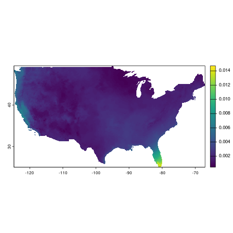

```{r setup, include = FALSE}
# packages
knitr::opts_chunk$set(
  collapse = TRUE,
  comment = ""
)
library(amadeus)
```

This vignette demonstrates how to download, process, and calculate covariates from the Climatology Lab's [gridMET](https://www.climatologylab.org/gridmet.html) dataset using `amadeus` functions.
Details are provided for each function's parameters and outputs.
The examples utilize daily specific humidity data.
See https://www.climatologylab.org/wget-gridmet.html for full variable names and acronyms.
The messages returned by `amadeus` functions have been omitted for brevity.

### Download

Start by downloading the netCDF data files with `download_data`.

* `dataset_name = "gridmet"`: gridMET dataset name.
* `variable = "Near-Surface Specific Humidity"`: specific humidity variable name.
* `year = c(2019, 2020)`: years of interest.
* `directory_to_save = dir`: directory to save the downloaded files.
* `acknowledgement = TRUE`: acknowledge that the raw data files are large and may consume lots of local storage.
* `download = TRUE`: download the data files.
* `remove_command = TRUE`: remove the temporary command file used to download the data.
* `hash = TRUE`: generate unique SHA-1 hash for the downloaded files.

```{r, eval = FALSE}
dir <- tempdir()
amadeus::download_data(
  dataset_name = "gridmet",
  variable = "Near-Surface Specific Humidity",
  year = c(2019, 2020),
  directory_to_save = dir,
  acknowledgement = TRUE,
  download = TRUE,
  remove_command = TRUE,
  hash = TRUE
)
```

```{r, echo = FALSE}
cat('[1] "aa5116525468299d1fc483b108b3e841fc40d7e5"')
```

Check the downloaded netCDF files.

```{r, eval = FALSE}
list.files(dir, recursive = TRUE, pattern = "sph")
```

```{r, echo = FALSE}
cat('[1] "sph/sph_2019.nc" "sph/sph_2020.nc"')
```

### Process

Import and process the downloaded netCDF files with `process_covariates`.

* `covariate = "gridmet"`: gridMET dataset name.
* `variable = "Near-Surface Specific Humidity"`: specific humidity variable name.
* `date = c("2019-12-13", "2022-01-10")`: date range of interest.
* `path = paste0(dir, "/sph")`: directory containing the downloaded files.

```{r, eval = FALSE}
sph_process <- amadeus::process_covariates(
  covariate = "gridmet",
  variable = "Near-Surface Specific Humidity",
  date = c("2019-12-18", "2020-01-10"),
  path = file.path(dir, "/sph")
)
```

Check the processed `SpatRaster` object.

```{r, eval = FALSE}
sph_process
```

```{r, echo = FALSE}
cat('class       : SpatRaster 
dimensions  : 585, 1386, 24  (nrow, ncol, nlyr)
resolution  : 0.04166667, 0.04166667  (x, y)
extent      : -124.7875, -67.0375, 25.04583, 49.42083  (xmin, xmax, ymin, ymax)
coord. ref. : lon/lat WGS 84 (EPSG:4326) 
sources     : sph_2019.nc  (14 layers) 
              sph_2020.nc  (10 layers) 
varnames    : sph (near-surface specific humidity) 
              sph (near-surface specific humidity) 
names       : sph_20191218, sph_20191219, sph_20191220, sph_20191221, sph_20191222, sph_20191223, ... 
unit        :        kg/kg,        kg/kg,        kg/kg,        kg/kg,        kg/kg,        kg/kg, ... 
time (days) : 2019-12-18 to 2020-01-10 
')
```

```{r, eval = FALSE}
terra::plot(sph_process[[1]])
```

{style="display: block; margin-left: auto; margin-right: auto;"}

### Calculate covariates

Calculate covariates for California county boundaries with `calculate_covariates`.
County boundaries are accessed with the `tigris::counties` function.\insertRef{package_tigris}

* `covariate = "gridmet"`: gridMET dataset name.
* `from = sph_process`: processed `SpatRaster` object.
* `locs = tigris::counties("CA", year = 2019)`: California county boundaries.
* `locs_id = "NAME"`: county name identifier.
* `radius = 0`: size of buffer radius around each county.
* `geom = "sf"`: return covariates as an `sf` object.

```{r, eval = FALSE}
library(tigris)
sph_covar <- amadeus::calculate_covariates(
  covariate = "gridmet",
  from = sph_process,
  locs = tigris::counties("CA", year = 2019),
  locs_id = "NAME",
  radius = 0,
  geom = "terra"
)
```

Check the calculated covariates `sf` object.

```{r, eval = FALSE}
sph_covar
```

```{r, echo = FALSE}
cat('class       : SpatVector 
geometry    : polygons 
dimensions  : 1392, 3  (geometries, attributes)
extent      : -124.482, -114.1312, 32.52883, 42.0095  (xmin, xmax, ymin, ymax)
coord. ref. : lon/lat WGS 84 (EPSG:4326) 
names       :          NAME       time    sph_0
type        :         <chr>   <POSIXt>    <num>
values      :        Sierra 2019-12-18 0.003101
                 Sacramento 2019-12-18 0.005791
              Santa Barbara 2019-12-18 0.004594
')
```
