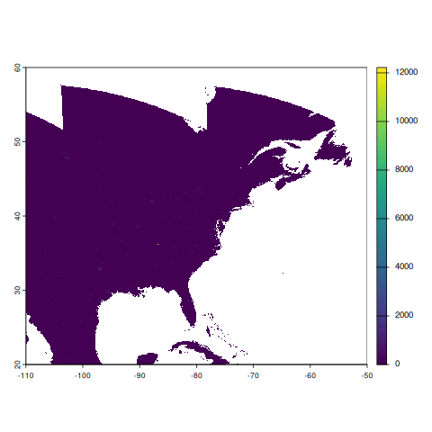

```{r setup, include = FALSE}
# packages
knitr::opts_chunk$set(
  collapse = TRUE,
  comment = ""
)
library(amadeus)
```

This vignette demonstrates how to download, process, and calculate covariates from the NASA's Moderate Resolution Imaging Spectroradiometer (MODIS) products using `amadeus` functions.
Examples are provided for the `MOD11A1` (land surface temperature), `MOD06_L2` (clouds 5-m L2 swath), and `VNP46A2` (VIIRS nightime lights) products.
The messages returned by `amadeus` functions have been omitted for brevity.

### MODIS Grids
MODIS product data files are separated based on tile grid numbers.
To download data for a specific geographic area, users must first identify which tile grids correspond to the area of interest.
The area of interest for these vignettes will be the contiguous United States, corresponding to horizontal tiles 7 to 13 and vertical tiles 3 to 6.
See [MODIS Grids](https://modis-land.gsfc.nasa.gov/MODLAND_grid.html) for further details.

### NASA Earthdata Token
To download NASA MODIS files, users must first register for a NASA EarthData account and generate a user-specific token.
For instructions, see the [Protected Data Sources](https://niehs.github.io/amadeus/articles/protected_datasets.html) vignette.

### MOD11A1 - Land Surface Temperature
The [MOD11A1 - MODIS/Terra Land Surface Temperature/Emissivity Daily L3 Global 1km SIN Grid V061](https://www.earthdata.nasa.gov/data/catalog/lpcloud-mod11a1-061) product provides daily, global land surface temperature (LST) estimates at 1km resolution.

Downloaded data files are Hierarchical Data Format (HDF), with the extension `.hdf`

* `dataset_name = "modis"`: MODIS dataset name.
* `product = "MOD11A1"`: MODIS product name.
* `version =  "61"`: Version 6.1 (most recent release as of 08/07/2025).
* `horizontal_tiles = c(7, 13)`: Horizontal sinusoidal tiles.
* `vertical_tiles = c(3, 6)`: Vertical sinusoidal tiles.
* `date = c("2019-09-01", "2019-09-02")`: Dates of interest.
* `nasa_earth_data_token = Sys.getenv("EARTHDATA_TOKEN")`: User-specific NASA credentials.
* `directory_to_save = dir_mod11a1`: directory to save the downloaded files.
* `acknowledgement = TRUE`: acknowledge that the raw data files are large and may consume lots of local storage.
* `download = TRUE`: download the data files.
* `remove_command = TRUE`: remove the temporary command file used to download the data.
* `hash = TRUE`: generate unique SHA-1 hash for the downloaded files.

```{r, eval = FALSE}
dir_mod11a1 <- file.path(tempdir(), "mod11a1")
amadeus::download_data(
  dataset_name = "modis",
  product = "MOD11A1",
  version = "61",
  horizontal_tiles = c(7, 13),
  vertical_tiles = c(3, 6),
  date = c("2019-08-15", "2019-08-16"),
  nasa_earth_data_token = Sys.getenv("EARTHDATA_TOKEN"),
  directory_to_save = dir_mod11a1,
  acknowledge = TRUE,
  download = TRUE,
  remove_command = TRUE,
  hash = TRUE
)
```

```{r, echo = FALSE}
cat("2 / 2 days of data available in the queried dates.

Downloading requested files...

[`wget` DOWNLOAD OUTPUT OMITTED]

Requested files have been downloaded.

Requests were processed.

[1] \"bbbd6812cf686d9dac059a6aab27293d\"
")
```

Check that the downloaded files correspond to the requested tiles and dates.

```{r, eval = FALSE}
list.files(dir_mod11a1, recursive = TRUE)
```

```{r, echo = FALSE}
cat(" [1] \"2019/244/MOD11A1.A2019244.h07v03.061.2020359040222.hdf\"
 [2] \"2019/244/MOD11A1.A2019244.h07v05.061.2020359040223.hdf\"
 [3] \"2019/244/MOD11A1.A2019244.h07v06.061.2020359040210.hdf\"
 [4] \"2019/244/MOD11A1.A2019244.h08v03.061.2020359040215.hdf\"
 [5] \"2019/244/MOD11A1.A2019244.h08v04.061.2020359040147.hdf\"
 [6] \"2019/244/MOD11A1.A2019244.h08v05.061.2020359040228.hdf\"
 [7] \"2019/244/MOD11A1.A2019244.h08v06.061.2020359040221.hdf\"
 [8] \"2019/244/MOD11A1.A2019244.h09v03.061.2020359040130.hdf\"
 [9] \"2019/244/MOD11A1.A2019244.h09v04.061.2020359040211.hdf\"
[10] \"2019/244/MOD11A1.A2019244.h09v05.061.2020359040208.hdf\"
[11] \"2019/244/MOD11A1.A2019244.h09v06.061.2020359040116.hdf\"
[12] \"2019/244/MOD11A1.A2019244.h10v03.061.2020359040202.hdf\"
[13] \"2019/244/MOD11A1.A2019244.h10v04.061.2020359040203.hdf\"
[14] \"2019/244/MOD11A1.A2019244.h10v05.061.2020359040223.hdf\"
[15] \"2019/244/MOD11A1.A2019244.h10v06.061.2020359040146.hdf\"
[16] \"2019/244/MOD11A1.A2019244.h11v03.061.2020359040221.hdf\"
[17] \"2019/244/MOD11A1.A2019244.h11v04.061.2020359040244.hdf\"
[18] \"2019/244/MOD11A1.A2019244.h11v05.061.2020359040135.hdf\"
[19] \"2019/244/MOD11A1.A2019244.h11v06.061.2020359040057.hdf\"
[20] \"2019/244/MOD11A1.A2019244.h12v03.061.2020359040138.hdf\"
[21] \"2019/244/MOD11A1.A2019244.h12v04.061.2020359040148.hdf\"
[22] \"2019/244/MOD11A1.A2019244.h12v05.061.2020359040131.hdf\"
[23] \"2019/244/MOD11A1.A2019244.h13v03.061.2020359040116.hdf\"
[24] \"2019/244/MOD11A1.A2019244.h13v04.061.2020359040145.hdf\"
[25] \"2019/245/MOD11A1.A2019245.h07v03.061.2020359055441.hdf\"
[26] \"2019/245/MOD11A1.A2019245.h07v05.061.2020359055458.hdf\"
[27] \"2019/245/MOD11A1.A2019245.h07v06.061.2020359055458.hdf\"
[28] \"2019/245/MOD11A1.A2019245.h08v03.061.2020359055537.hdf\"
[29] \"2019/245/MOD11A1.A2019245.h08v04.061.2020359055634.hdf\"
[30] \"2019/245/MOD11A1.A2019245.h08v05.061.2020359055658.hdf\"
[31] \"2019/245/MOD11A1.A2019245.h08v06.061.2020359055704.hdf\"
[32] \"2019/245/MOD11A1.A2019245.h09v03.061.2020359055648.hdf\"
[33] \"2019/245/MOD11A1.A2019245.h09v04.061.2020359055602.hdf\"
[34] \"2019/245/MOD11A1.A2019245.h09v05.061.2020359055715.hdf\"
[35] \"2019/245/MOD11A1.A2019245.h09v06.061.2020359055649.hdf\"
[36] \"2019/245/MOD11A1.A2019245.h10v03.061.2020359055611.hdf\"
[37] \"2019/245/MOD11A1.A2019245.h10v04.061.2020359055559.hdf\"
[38] \"2019/245/MOD11A1.A2019245.h10v05.061.2020359055531.hdf\"
[39] \"2019/245/MOD11A1.A2019245.h10v06.061.2020359055702.hdf\"
[40] \"2019/245/MOD11A1.A2019245.h11v03.061.2020359055542.hdf\"
[41] \"2019/245/MOD11A1.A2019245.h11v04.061.2020359055542.hdf\"
[42] \"2019/245/MOD11A1.A2019245.h11v05.061.2020359055613.hdf\"
[43] \"2019/245/MOD11A1.A2019245.h11v06.061.2020359055445.hdf\"
[44] \"2019/245/MOD11A1.A2019245.h12v03.061.2020359055532.hdf\"
[45] \"2019/245/MOD11A1.A2019245.h12v04.061.2020359055524.hdf\"
[46] \"2019/245/MOD11A1.A2019245.h12v05.061.2020359055454.hdf\"
[47] \"2019/245/MOD11A1.A2019245.h13v03.061.2020359055516.hdf\"
[48] \"2019/245/MOD11A1.A2019245.h13v04.061.2020359055521.hdf\"
")
```

Unlike other `amadeus`-supported datasets, **users do not need to directly call the `process_modis_merge` function.**
This function is passed to the `calculate_covariates` function based on the `preprocess` parameter.
Within `calculate_covariates,` the `process_modis_merge` function imports the downloaded files and merges them according to their tile position.

Check the available layers from the product.
The first file is used to identify the available layers.

```{r, eval = FALSE}
terra::describe(
  list.files(dir_mod11a1, full.names = TRUE, recursive = TRUE)[1],
  sds = TRUE
)$var
```

```{r, echo = FALSE}
cat(" [1] \"LST_Day_1km\"     \"QC_Day\"          \"Day_view_time\"   \"Day_view_angl\"
 [5] \"LST_Night_1km\"   \"QC_Night\"        \"Night_view_time\" \"Night_view_angl\"
 [9] \"Emis_31\"         \"Emis_32\"         \"Clear_day_cov\"   \"Clear_night_cov\"
")
```

For the example, we are interested in the `LST_Day_1km` variable for daytime land surface temperature.

Process, inspect, and plot the LST data from August 15, 2019.
**Note**, when calling `process_modis_merge` directly, users can only process one day per function call.

```{r, eval = FALSE}
rast_mod11a1 <- amadeus::process_modis_merge(
  path = list.files(dir_mod11a1, full.names = TRUE, recursive = TRUE),
  date = "2019-08-15",
  subdataset = "LST_Day_1km"
)
rast_mod11a1
```

```{r, echo = FALSE}
cat("class       : SpatRaster
size        : 4800, 8400, 1  (nrow, ncol, nlyr)
resolution  : 926.6254, 926.6254  (x, y)
extent      : -12231456, -4447802, 2223901, 6671703  (xmin, xmax, ymin, ymax)
coord. ref. : +proj=sinu +lon_0=0 +x_0=0 +y_0=0 +R=6371007.181 +units=m +no_defs
source(s)   : memory
varname     : MOD11A1.A2019244.h07v03.061.2020359040222
name        : LST_Day_1km
min value   :       12609
max value   :       16886
")
```

```{r, eval = FALSE}
terra::plot(rast_mod11a1$LST_Day_1km)
```

{style="display: block; margin-left: auto; margin-right: auto;"}

As mentioned before, this processing is not part of the `amadeus` workflow for MODIS products.
To calculate covariates for MODIS products, the preprocess function and layer selections are passed as parameters to `calculate_covariates`.
The following code will calculate mean LST for Connecticut's counties for August 15 and 16, 2019.

* `dataset_name = "modis"`: MODIS dataset name.
* `from = list.files(dir_mod11a1, full.names = TRUE, recursive = TRUE)`: MOD11A1 file paths. The dates of data available in these file paths will determine the dates in the output.
* `locs = tigris::counties("CT", year = 2019, cb = TRUE)`: Connecticut county polygons.
* `locs_id = "NAME"`: Use `NAME` column for unique county identifiers.
* `radius = 0L`: Apply 0m buffer to plygons.
* `preprocess = amadeus::process_modis_merge`: Preprocess `.hdf` files with the merging function.
* `subdataset = "LST_Day_1km"`: Daytime LST variable code.
* `name_covariates = "LST_"`: Prefix for column name for calculated covariates.
* `fun_summary = "mean"`: Calculate mean LST value.
* `geom = FALSE`: Do not return with spatial geometries (ie. return as `data.frame`).
* `scale = "* 0.02 - 273.15"`: Multiply values by 0.02 and subtract 273.15. 

The `scale` parameter is crucial as it scales the values stored in the `.hdf` files to the scientifically interpretable values.
The scale factor for each MODIS product can be found in the technical documentation (also called User Guide).
The scale factor for MOD11A1 is 0.02 (see [https://lpdaac.usgs.gov/documents/715/MOD11_User_Guide_V61.pdf] Table 3. The SDSs in the MOD11_L2 product).
This scale factor converts the values to Kelvin, which are then converted to Celsius with the additional `- 273.15` expression.

```{r, eval = FALSE}
df_mod11a1 <- amadeus::calculate_covariates(
  dataset_name = "modis",
  from = list.files(dir_mod11a1, full.names = TRUE, recursive = TRUE),
  locs = tigris::counties("CT", year = 2019),
  locs_id = "NAME",
  radius = 0L,
  preprocess = amadeus::process_modis_merge,
  subdataset = "LST_Day_1km",
  name_covariates = "LST_",
  fun_summary = "mean",
  geom = FALSE,
  scale = "* 0.02 - 273.15"
)
df_mod11a1
```

```{r, echo = FALSE}
cat("         NAME LST_00000       time
1   Middlesex  28.06504 2019-08-15
2  New London  27.04361 2019-08-15
3   New Haven  28.30738 2019-08-15
4     Tolland  27.73284 2019-08-15
5    Hartford  28.19241 2019-08-15
6     Windham  26.81317 2019-08-15
7   Fairfield  27.98380 2019-08-15
8  Litchfield  26.95756 2019-08-15
9   Middlesex  24.12254 2019-08-16
10 New London  24.15377 2019-08-16
11  New Haven  25.04651 2019-08-16
12    Tolland  24.82655 2019-08-16
13   Hartford  26.15234 2019-08-16
14    Windham  22.61115 2019-08-16
15  Fairfield  24.45862 2019-08-16
16 Litchfield  24.06681 2019-08-16
")
```

In the `data.frame`, mean LST values for each county are calculated for August 15 and 16, 2019, the same dates originally passed to `download_data`.
The column containing the mean LST variables is `LST_00000`, which reflects our manually set `name_covariates = "LST_"` prefix **and the buffer radius (padded to 5 digits)**.
The `LST_00000` column contains LST values in Celsius, per the `scale` parameter.

If we were to calculate mean LST at the centroid of each Connecticut county with a 100m buffer, the covariate column name would be `LST_00100`.

```{r, eval = FALSE}
df_mod11a1_centroids <- amadeus::calculate_covariates(
  dataset_name = "modis",
  from = list.files(dir_mod11a1, full.names = TRUE, recursive = TRUE),
  locs = sf::st_centroid( # centroids of each county
    tigris::counties("CT", year = 2019)
  ),
  locs_id = "NAME",
  radius = 100L, # 100 meter circular buffer
  preprocess = amadeus::process_modis_merge,
  subdataset = "LST_Day_1km",
  name_covariates = "LST_",
  fun_summary = "mean",
  geom = FALSE,
  scale = "* 0.02 - 273.15"
)
df_mod11a1_centroids
```

```{r, echo = FALSE}
cat("         NAME LST_00100       time
1   Middlesex  26.19000 2019-08-15
2  New London  27.40616 2019-08-15
3   New Haven  32.71462 2019-08-15
4     Tolland  27.31000 2019-08-15
5    Hartford  32.75000 2019-08-15
6     Windham  26.47000 2019-08-15
7   Fairfield  28.18088 2019-08-15
8  Litchfield  22.83000 2019-08-15
9   Middlesex  23.51000 2019-08-16
10 New London  23.73023 2019-08-16
11  New Haven  28.45154 2019-08-16
12    Tolland  25.13000 2019-08-16
13   Hartford  29.47000 2019-08-16
14    Windham  24.43000 2019-08-16
15  Fairfield  22.41000 2019-08-16
16 Litchfield  21.07516 2019-08-16
")
```

### VNP46A2 - Nighttime Lights
The [VNP46A2 - VIIRS/NPP Gap-Filled Lunar BRDF-Adjusted Nighttime Lights Daily L3 Global 500m Linear Lat Lon Grid](https://ladsweb.modaps.eosdis.nasa.gov/missions-and-measurements/products/VNP46A2/) provides "global, daily measurements of nocturnal visible and near-infrared (NIR) light that are suitable for Earth system science and applications".

Downloaded data files are Hierarchical Data Format version 5 (HDF5), with the extension `.h5`

* `dataset_name = "modis"`: MODIS dataset name.
* `product = "VNP46A2"`: MODIS product name.
* `version =  "61"`: Version 6.1 (most recent release as of 08/07/2025).
* `horizontal_tiles = c(7, 13)`: Horizontal sinusoidal tiles.
* `vertical_tiles = c(3, 6)`: Vertical sinusoidal tiles.
* `date = c("2019-09-01", "2019-09-02")`: Dates of interest.
* `nasa_earth_data_token = Sys.getenv("EARTHDATA_TOKEN")`: User-specific NASA credentials.
* `directory_to_save = dir_vnp46a2`: directory to save the downloaded files.
* `acknowledgement = TRUE`: acknowledge that the raw data files are large and may consume lots of local storage.
* `download = TRUE`: download the data files.
* `remove_command = TRUE`: remove the temporary command file used to download the data.
* `hash = TRUE`: generate unique SHA-1 hash for the downloaded files.

```{r, eval = FALSE}
dir_vnp46a2 <- file.path(tempdir(), "vnp46a2")
amadeus::download_data(
  dataset_name = "modis",
  product = "VNP46A2",
  version = "61",
  horizontal_tiles = c(7, 13),
  vertical_tiles = c(3, 6),
  date = c("2019-08-15", "2019-08-16"),
  nasa_earth_data_token = Sys.getenv("EARTHDATA_TOKEN"),
  directory_to_save = dir_vnp46a2,
  acknowledge = TRUE,
  download = TRUE,
  remove_command = TRUE,
  hash = TRUE
)
```

```{r, echo = FALSE}
cat("2 / 2 days of data available in the queried dates.

Downloading requested files...

[`wget` DOWNLOAD OUTPUT OMITTED]

Requested files have been downloaded.

Requests were processed.

[1] \"c7ada546dd471eedcce3266fd860c8fe\"
")
```

Check that the downloaded files correspond to the requested tiles and dates.

```{r, eval = FALSE}
list.files(dir_vnp46a2, recursive = TRUE)
```

```{r, echo = FALSE}
cat(" [1] \"2019/227/VNP46A2.A2019227.h07v03.001.2021028023053.h5\"
 [2] \"2019/227/VNP46A2.A2019227.h07v04.001.2021034095643.h5\"
 [3] \"2019/227/VNP46A2.A2019227.h07v05.001.2021034103316.h5\"
 [4] \"2019/227/VNP46A2.A2019227.h07v06.001.2021034065004.h5\"
 [5] \"2019/227/VNP46A2.A2019227.h08v03.001.2021028011018.h5\"
 [6] \"2019/227/VNP46A2.A2019227.h08v04.001.2021034074618.h5\"
 [7] \"2019/227/VNP46A2.A2019227.h08v05.001.2021034053658.h5\"
 [8] \"2019/227/VNP46A2.A2019227.h08v06.001.2021033195730.h5\"
 [9] \"2019/227/VNP46A2.A2019227.h09v03.001.2021027223658.h5\"
[10] \"2019/227/VNP46A2.A2019227.h09v04.001.2021034071039.h5\"
[11] \"2019/227/VNP46A2.A2019227.h09v05.001.2021034063949.h5\"
[12] \"2019/227/VNP46A2.A2019227.h09v06.001.2021033151848.h5\"
[13] \"2019/227/VNP46A2.A2019227.h10v03.001.2021028020730.h5\"
[14] \"2019/227/VNP46A2.A2019227.h10v04.001.2021034051503.h5\"
[15] \"2019/227/VNP46A2.A2019227.h10v05.001.2021033165400.h5\"
[16] \"2019/227/VNP46A2.A2019227.h10v06.001.2021033140014.h5\"
[17] \"2019/227/VNP46A2.A2019227.h11v03.001.2021028020226.h5\"
[18] \"2019/227/VNP46A2.A2019227.h11v04.001.2021033204459.h5\"
[19] \"2019/227/VNP46A2.A2019227.h11v05.001.2021033095716.h5\"
[20] \"2019/227/VNP46A2.A2019227.h12v03.001.2021027174719.h5\"
[21] \"2019/227/VNP46A2.A2019227.h12v04.001.2021033162849.h5\"
[22] \"2019/228/VNP46A2.A2019228.h07v03.001.2021028030331.h5\"
[23] \"2019/228/VNP46A2.A2019228.h07v04.001.2021034113626.h5\"
[24] \"2019/228/VNP46A2.A2019228.h07v05.001.2021034115815.h5\"
[25] \"2019/228/VNP46A2.A2019228.h07v06.001.2021034080708.h5\"
[26] \"2019/228/VNP46A2.A2019228.h08v03.001.2021028014406.h5\"
[27] \"2019/228/VNP46A2.A2019228.h08v04.001.2021034092243.h5\"
[28] \"2019/228/VNP46A2.A2019228.h08v05.001.2021034065601.h5\"
[29] \"2019/228/VNP46A2.A2019228.h08v06.001.2021033202639.h5\"
[30] \"2019/228/VNP46A2.A2019228.h09v03.001.2021027230113.h5\"
[31] \"2019/228/VNP46A2.A2019228.h09v04.001.2021034083500.h5\"
[32] \"2019/228/VNP46A2.A2019228.h09v05.001.2021034075715.h5\"
[33] \"2019/228/VNP46A2.A2019228.h09v06.001.2021033154608.h5\"
[34] \"2019/228/VNP46A2.A2019228.h10v03.001.2021028024419.h5\"
[35] \"2019/228/VNP46A2.A2019228.h10v04.001.2021034064406.h5\"
[36] \"2019/228/VNP46A2.A2019228.h10v05.001.2021033174505.h5\"
[37] \"2019/228/VNP46A2.A2019228.h10v06.001.2021033144003.h5\"
[38] \"2019/228/VNP46A2.A2019228.h11v03.001.2021028023944.h5\"
[39] \"2019/228/VNP46A2.A2019228.h11v04.001.2021033213449.h5\"
[40] \"2019/228/VNP46A2.A2019228.h11v05.001.2021033101041.h5\"
[41] \"2019/228/VNP46A2.A2019228.h12v03.001.2021027180253.h5\"
[42] \"2019/228/VNP46A2.A2019228.h12v04.001.2021033170017.h5\"
")
```

The processing function associated with the `VNP46A2` product is `process_blackmarble`, designed to accomodate the `.h5` file type.
Again, **users do not need to directly call the `process_modis_merge` function.**, this function is passed to the `calculate_covariates` function based on the `preprocess` parameter.
The following "processing" steps are for demonstration only.

Check the available layers from the product.
The first file is used to identify the available layers.

```{r, eval = FALSE}
terra::describe(
  list.files(dir_vnp46a2, full.names = TRUE, recursive = TRUE)[1],
  sds = TRUE
)$var
```

```{r, echo = FALSE}
cat("[1] \"//HDFEOS/GRIDS/VNP_Grid_DNB/Data_Fields/DNB_BRDF-Corrected_NTL\"
[2] \"//HDFEOS/GRIDS/VNP_Grid_DNB/Data_Fields/DNB_Lunar_Irradiance\"
[3] \"//HDFEOS/GRIDS/VNP_Grid_DNB/Data_Fields/Gap_Filled_DNB_BRDF-Corrected_NTL\"
[4] \"//HDFEOS/GRIDS/VNP_Grid_DNB/Data_Fields/Latest_High_Quality_Retrieval\"
[5] \"//HDFEOS/GRIDS/VNP_Grid_DNB/Data_Fields/Mandatory_Quality_Flag\"
[6] \"//HDFEOS/GRIDS/VNP_Grid_DNB/Data_Fields/QF_Cloud_Mask\"
[7] \"//HDFEOS/GRIDS/VNP_Grid_DNB/Data_Fields/Snow_Flag\"
")
```

We are interested in the subdataset `//HDFEOS/GRIDS/VNP_Grid_DNB/Data_Fields/Gap_Filled_DNB_BRDF-Corrected_NTL`, which contains the gap-filled Day-Night Band, Corrected Nighttime Lights (NTL) data.
The variable string associated with the `.h5` file type is long and complex, so we can identify the subset of interest with the index value.
In this case, `subdataset = 3L` because `Gap_Filled_DNB_BRDF-Corrected_NTL` is the third subdataset in the file.
The `tile_df` parameter is unique to the `process_blackmarble` processing function, and is set to the output of the `process_blackmarble_corners` function.
`process_blackmarble_corners` generates a `data.frame` of corner coordinates based on the sinuosidal grid tiles because the HDF5 format are read without georeference.

```{r, eval = FALSE}
rast_vnp46a2 <- amadeus::process_blackmarble(
  path = list.files(dir_vnp46a2, full.names = TRUE, recursive = TRUE),
  date = "2019-08-15",
  tile_df = amadeus::process_blackmarble_corners(
    hrange = c(7, 13),
    vrange = c(3, 6)
  ),
  subdataset = 3L
)
rast_vnp46a2
```

```{r, echo = FALSE}
cat("class       : SpatRaster
size        : 9600, 14400, 1  (nrow, ncol, nlyr)
resolution  : 0.004166667, 0.004166667  (x, y)
extent      : -110, -50, 20, 60  (xmin, xmax, ymin, ymax)
coord. ref. : lon/lat WGS 84 (EPSG:4326)
source(s)   : memory
varname     : Gap_Filled_DNB_BRDF-Corrected_NTL
name        : DNB_BRDF-Corrected_NTL
min value   :                      0
max value   :                  49993
")
```

```{r, eval = FALSE}
terra::plot(rast_vnp46a2)
```

{style="display: block; margin-left: auto; margin-right: auto;"}

The following code will calculate maximum NTL values for Connecticut's counties for August 15 and 16, 2019.

* `dataset_name = "modis"`: MODIS dataset name.
* `from = list.files(dir_mod11a1, full.names = TRUE, recursive = TRUE)`: MOD11A1 file paths. The dates of data available in these file paths will determine the dates in the output.
* `locs = tigris::counties("CT", year = 2019, cb = TRUE)`: Connecticut county polygons.
* `locs_id = "NAME"`: Use `NAME` column for unique county identifiers.
* `radius = 0L`: Apply 0m buffer to plygons.
* `preprocess = amadeus::process_blackmarble`: Preprocess `.h5` files with merging function.
* `tile_df = amadeus::process_blackmarble_corners(hrange = c(7, 13), vrange = c(3, 6)))`: Process combination of horizontal tiles 7 to 13 and vertical tiles 3 to 6.
* `subdataset = 3L`: Third subdataset for NTL variable (`Gap_Filled_DNB_BRDF-Corrected_NTL`).
* `name_covariates = "NTL_"`: Prefix for column name for calculated covariates.
* `fun_summary = "max"`: Calculate maximum NTL value.
* `geom = "terra"`: Return as a `terra` `SpatVector` object.
* `scale = "* 1.0`: Multiply values by 1.0.

The scale factor for VNP46A2 is 1.0 (see [https://ladsweb.modaps.eosdis.nasa.gov/api/v2/content/archives/Document%20Archive/Science%20Data%20Product%20Documentation/Black-Marble_v2.0_UG_2024.pdf] Table 8. Scientific datasets included in VNP46A2/VJI46A2 daily moonlight-adjusted NTL product).

```{r, eval = FALSE}
vect_vnp46a2 <- amadeus::calculate_covariates(
  covariate = "modis",
  from = list.files(dir_vnp46a2, full.names = TRUE, recursive = TRUE),
  locs = tigris::counties("CT", year = 2019),
  locs_id = "NAME",
  radius = 0L,
  preprocess = amadeus::process_blackmarble,
  tile_df = amadeus::process_blackmarble_corners(
    hrange = c(7, 13), vrange = c(3, 6)
  ),
  subdataset = 3L,
  name_covariates = "NTL_",
  fun_summary = "max",
  geom = "terra",
  scale = "* 1.0"
)
vect_vnp46a2
```

```{r, echo = FALSE}
cat(" class       : SpatVector
 geometry    : polygons
 dimensions  : 16, 3  (geometries, attributes)
 extent      : -73.72777, -71.78724, 40.95094, 42.05051  (xmin, xmax, ymin, ymax)
 coord. ref. : lon/lat NAD83 (EPSG:4269)
 names       :      NAME NTL_00000       time
 type        :     <chr>     <num>   <POSIXt>
 values      : Fairfield       855 2019-08-15
               Fairfield       670 2019-08-16
                Hartford       380 2019-08-15
")
```
