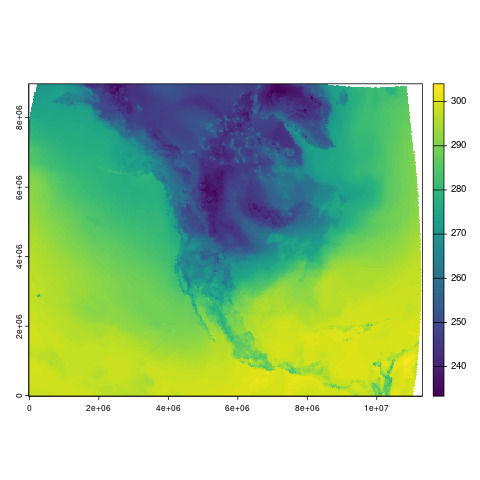

```{r setup, include = FALSE}
# packages
knitr::opts_chunk$set(
  collapse = TRUE,
  comment = ""
)
library(amadeus)
```

This vignette demonstrates how to download, process, and calculate covariates from the [NOAA North American Regional Reanalysis (NARR)](https://psl.noaa.gov/data/gridded/data.narr.html) dataset using `amadeus` functions.
Details are provided for each function's parameters and outputs.
The examples utilize daily air temperature at 2m height ("air.2m") data.
The messages returned by `amadeus` functions have been omitted for brevity.

### Download

Start by downloading the netCDF data files with `download_data`.

* `dataset_name = "narr"`: NARR dataset acronym.
* `variable = "air.2m"`: air temperature at 2m height variable code.
* `year = c(2021, 2022)`: years of interest.
* `directory_to_save = dir`: directory to save the downloaded files.
* `acknowledgement = TRUE`: acknowledge that the raw data files are large and may consume lots of local storage.
* `download = TRUE`: download the data files.
* `remove_command = TRUE`: remove the temporary command file used to download the data.
* `hash = TRUE`: generate unique SHA-1 hash for the downloaded files.

```{r, eval = FALSE}
dir <- tempdir()
amadeus::download_data(
  dataset_name = "narr",
  variable = "air.2m",
  year = c(2021, 2022),
  directory_to_save = dir,
  acknowledgement = TRUE,
  download = TRUE,
  remove_command = TRUE,
  hash = TRUE
)
```
```{r, echo = FALSE}
cat('[1] "e839448db9634a6534f89f5e8a1d18525dc3b206"')
```

Check the downloaded netCDF files.

```{r, eval = FALSE}
list.files(dir, recursive = TRUE, pattern = "air.2m")
```

```{r, echo = FALSE}
cat('[1] "air.2m/air.2m.2021.nc" "air.2m/air.2m.2022.nc"')
```

### Process

Import and process the downloaded netCDF files with `process_covariates`.

* `covariate = "narr"`: NARR dataset acronym.
* `variable = "air.2m"`: air temperature at 2m height variable code.
* `date = c("2021-12-28", "2022-01-03")`: date range of interest.
* `path = paste0(dir, "/air.2m")`: directory containing the downloaded files.

```{r, eval = FALSE}
air2m_process <- amadeus::process_covariates(
  covariate = "narr",
  variable = "air.2m",
  date = c("2021-12-28", "2022-01-03"),
  path = file.path(dir, "/air.2m")
)
```

Check the processed `SpatRaster` object.

```{r, eval = FALSE}
air2m_process
```

```{r, echo = FALSE}
cat("class       : SpatRaster
dimensions  : 277, 349, 7  (nrow, ncol, nlyr)
resolution  : 32462.99, 32463  (x, y)
extent      : -16231.49, 11313351, -16231.5, 8976020  (xmin, xmax, ymin, ymax)
coord. ref. : +proj=lcc +lat_0=50 +lon_0=-107 +lat_1=50 +lat_2=50 +x_0=5632642.22547 +y_0=4612545.65137 +datum=WGS84 +units=m +no_defs
sources     : air.2m.2021.nc:air  (4 layers)
              air.2m.2022.nc:air  (3 layers)
varnames    : air (Daily Air Temperature at 2 m)
              air (Daily Air Temperature at 2 m)
names       : air.2~11228, air.2~11229, air.2~11230, air.2~11231, air.2~20101, air.2~20102, ...
unit        :           K,           K,           K,           K,           K,           K, ...
time        : 2021-12-28 to 2022-01-03 UTC
")
```

```{r, eval = FALSE}
terra::plot(air2m_process[[1]])
```

{style="display: block; margin-left: auto; margin-right: auto;"}

### Calculate covariates

Calculate covariates for North Carolina county boundaries with `calculate_covariates`.
County boundaries are accessed with the `tigris::counties` function.\insertRef{package_tigris}

* `covariate = "narr"`: NARR dataset acronym.
* `from = air2m_process`: processed `SpatRaster` object.
* `locs = tigris::counties("NC", year = 2021)`: North Carolina county boundaries.
* `locs_id = "NAME"`: county name identifier.
* `radius = 0`: size of buffer radius around each county.
* `geom = "terra"`: return covariates as a `SpatVector` object.

```{r, eval = FALSE}
library(tigris)
air2m_covar <- amadeus::calculate_covariates(
  covariate = "narr",
  from = air2m_process,
  locs = tigris::counties("NC", year = 2021),
  locs_id = "NAME",
  radius = 0,
  geom = "terra"
)
```

Check the calculated covariates `SpatVector` object.

```{r, eval = FALSE}
air2m_covar
```

```{r, echo = FALSE}
cat("class       : SpatVector
geometry    : polygons
dimensions  : 700, 3  (geometries, attributes)
extent      : 7731783, 8506154, 3248490, 3694532  (xmin, xmax, ymin, ymax)
coord. ref. : +proj=lcc +lat_0=50 +lon_0=-107 +lat_1=50 +lat_2=50 +x_0=5632642.22547 +y_0=4612545.65137 +datum=WGS84 +units=m +no_defs
names       :     NAME       time air.2m_0
type        :    <chr>   <POSIXt>    <num>
values      :  Chatham 2021-12-28    289.3
              Alamance 2021-12-28    288.8
              Davidson 2021-12-28    289.1
")
```
