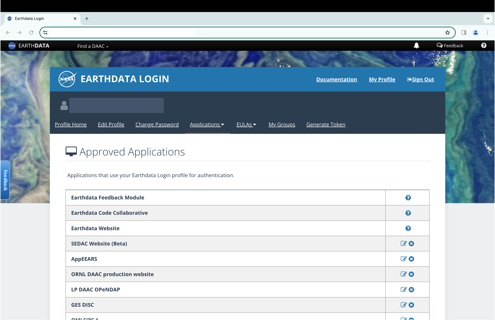

The `download_data` function from `amadeus` provides access to a variety of
publicly available environmental data sources.
Although publicly available, certain data sources are protected and require
users to provide login credentials before accessing and downloading the data.
Datasets from the National Aeronautics and Space Administration (NASA), for
example, require users to have and provide credentials for a NASA EarthData
account.

## Motivation

This vignette will demonstrate how to create a NASA EarthData Account,
generate a personal access token, and configure `amadeus` to authenticate
automatically using that token.

## NASA EarthData Account

Visit [https://urs.earthdata.nasa.gov/](https://urs.earthdata.nasa.gov/) to
register for or log into a NASA EarthData account.


Account registration provides access to NASA's Earth Observing System Data
and Information System (EOSDIS) and its twelve Distributed Active Archive
Centers (DAAC), including:

-   Alaska Satellite Facility (ASF) DAAC
-   Atmospheric Science Data Center (ASDC)
-   Crustal Dynamics Data Information System (CDDIS)
-   Global Hydrometeorology Resource Center (GHRC)
-   Goddard Earth Sciences Data and Information Services Center (GES DISC)
-   Land Processes DAAC (LP DAAC)
-   Level 1 and Atmosphere Archive and Distribution System (LAADS) DAAC
-   National Snow and Ice Data Center (NSIDC) DAAC
-   Oak Ridge National Laboratory (ORNL) DAAC
-   Ocean Biology DAAC (OB.DAAC)
-   Physical Oceanography DAAC (PO.DAAC)
-   Socioeconomic Data and Applications Center (SEDAC)

See <https://www.earthdata.nasa.gov/eosdis/daacs> for more information.

### Approved applications

After creating an account, navigate to "My Profile"
(https://urs.earthdata.nasa.gov/profile), and then to
"Applications \> Authorized Apps". This "Authorized Apps" page specifies
which NASA EarthData applications can use your login credentials. For this
example, ensure that authorization is enabled for "SEDAC Website",
"SEDAC Website (Alpha)", and "SEDAC Website (Beta)".



## Generating a NASA EarthData Token

With a NASA EarthData account set up and the required applications authorized,
generate a personal access token to use with `amadeus`.

1. Log in to [https://urs.earthdata.nasa.gov/](https://urs.earthdata.nasa.gov/)
2. Navigate to "My Profile" → "Generate Token"
3. Click "Generate Token" and copy the resulting token string

Tokens expire after 90 days. Repeat these steps to generate a new token when
needed.

## Setting Up Authentication in R

`amadeus` provides `setup_nasa_token()` to securely store your token so
it is available in every R session without ever appearing in scripts or
version-controlled files.

### Recommended: persist in `~/.Renviron`

```{r, eval = FALSE}
# Interactively prompts for the token, then writes to ~/.Renviron
setup_nasa_token(method = "renviron")
```

After running this command, restart R (or run `readRenviron("~/.Renviron")`)
for the environment variable `NASA_EARTHDATA_TOKEN` to take effect.
Subsequent R sessions will pick up the token automatically.

Alternatively, pass the token directly:

```{r, eval = FALSE}
setup_nasa_token(method = "renviron", token = "your_token_here")
```

### Save to a token file

```{r, eval = FALSE}
# Saves token to ~/.nasa_earthdata_token (permissions set to user-only)
setup_nasa_token(method = "file", token = "your_token_here")
```

Pass the file path to individual download functions:

```{r, eval = FALSE}
download_data(
  dataset_name = "sedac_population",
  year = "2020",
  data_format = "GeoTIFF",
  data_resolution = "60 minute",
  directory_to_save = "./sedac_population",
  acknowledgement = TRUE,
  nasa_earth_data_token = "~/.nasa_earthdata_token"
)
```

### Current session only

```{r, eval = FALSE}
# Sets the token for the current R session only (lost on exit)
setup_nasa_token(method = "session", token = "your_token_here")
```

Or set the environment variable manually:

```{r, eval = FALSE}
Sys.setenv(NASA_EARTHDATA_TOKEN = "your_token_here")
```

## How `amadeus` Uses the Token

All NASA download functions (MERRA-2, MODIS, GEOS-CF, SEDAC population,
SEDAC groads) call `get_token()` internally.
The lookup priority is:

1. `NASA_EARTHDATA_TOKEN` environment variable (set via `~/.Renviron` or
   `Sys.setenv()`) — **recommended**
2. File path passed as `nasa_earth_data_token` argument
3. Token string passed directly as `nasa_earth_data_token` argument
   (not recommended for scripts)

Once the token is configured in `~/.Renviron`, no extra arguments are needed:

```{r, eval = FALSE}
# NASA_EARTHDATA_TOKEN is read automatically from the environment
download_data(
  dataset_name = "sedac_population",
  year = "2020",
  data_format = "GeoTIFF",
  data_resolution = "60 minute",
  directory_to_save = "./sedac_population",
  acknowledgement = TRUE
)
```

```{r, echo = FALSE}
to_cat <-
  paste0(
    "Using token from environment variable: NASA_EARTHDATA_TOKEN\n",
    "Downloading requested files...\n",
    "Requested files have been downloaded.\n",
    "Unzipping files...\n",
    "Files unzipped and saved in ./sedac_population/.\n"
  )
cat(to_cat)
```

Check the downloaded data files.

```{r, eval = FALSE}
list.files("./sedac_population")
```

```{r, echo = FALSE}
sedac_files <- c(
  paste0(
    "gpw_v4_population_density_adjusted_to_2015_unwpp_country_totals_",
    "rev11_2020_1_deg_tif_readme.txt"
  ),
  paste0(
    "gpw_v4_population_density_adjusted_to_2015_unwpp_country_totals_",
    "rev11_2020_1_deg_tif.zip"
  ),
  paste0(
    "gpw_v4_population_density_adjusted_to_2015_unwpp_country_totals_",
    "rev11_2020_1_deg.tif"
  )
)
sedac_files
```

As indicated by the files in `./sedac_population`, the data files have been
downloaded properly.

## References

-   EOSDIS Distributed Active Archive Centers (DAAC).
    *National Aeronautics and Space Administration (NASA)*.
    Date accessed: January 3, 2024.
    <https://www.earthdata.nasa.gov/eosdis/daacs>.
-   NASA EarthData Token Documentation.
    *National Aeronautics and Space Administration (NASA)*.
    <https://urs.earthdata.nasa.gov/documentation/for_users/user_token>.
