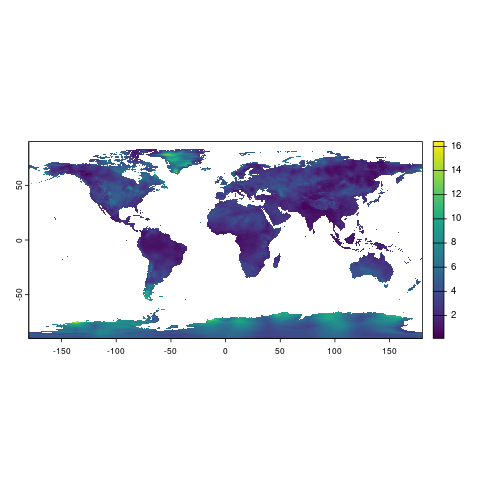

```{r setup, include = FALSE}
# packages
knitr::opts_chunk$set(
  collapse = TRUE,
  comment = ""
)
library(amadeus)
```

This vignette demonstrates how to download, process, and calculate covariates from the Climatology Lab's [TerraClimate](https://www.climatologylab.org/terraclimate.html) dataset using `amadeus` functions.
Details are provided for each function's parameters and outputs.
The examples utilize monthly wind speed data.
See https://www.climatologylab.org/wget-terraclimate.html for full variable names and acronyms.
The messages returned by `amadeus` functions have been omitted for brevity.

### Download

Start by downloading the netCDF data files with `download_data`.

* `dataset_name = "terraclimate"`: TerraClimate dataset name.
* `variable = "Wind Speed"`: wind speed variable name.
* `year = c(2021, 2022)`: years of interest.
* `directory_to_save = dir`: directory to save the downloaded files.
* `acknowledgement = TRUE`: acknowledge that the raw data files are large and may consume lots of local storage.
* `download = TRUE`: download the data files.
* `remove_command = TRUE`: remove the temporary command file used to download the data.
* `hash = TRUE`: generate unique SHA-1 hash for the downloaded files.

```{r, eval = FALSE}
dir <- tempdir()
amadeus::download_data(
  dataset_name = "terraclimate",
  variable = "Wind Speed",
  year = c(2021, 2022),
  directory_to_save = dir,
  acknowledgement = TRUE,
  download = TRUE,
  remove_command = TRUE,
  hash = TRUE
)
```

```{r, echo = FALSE}
cat('[1] "344cddba906371b701f661ccebeef3f427b2d8ec"')
```

Check the downloaded netCDF files.

```{r, eval = FALSE}
list.files(dir, recursive = TRUE, pattern = "ws")
```

```{r, echo = FALSE}
cat('[1] "ws/ws_2021.nc" "ws/ws_2022.nc"')
```

### Process

Import and process the downloaded netCDF files with `process_covariates`.

**Parameters:**

* `covariate = "terraclimate"`: TerraClimate dataset name.
* `variable = "Wind Speed"`: wind speed variable name.
* `date = c("2021-12-28", "2022-01-03")`: date range of interest.
* `path = paste0(dir, "/ws")`: directory containing the downloaded files.

```{r, eval = FALSE}
ws_process <- amadeus::process_covariates(
  covariate = "terraclimate",
  variable = "Wind Speed",
  date = c("2021-12-28", "2022-01-03"),
  path = file.path(dir, "/ws")
)
```

Check the processed `SpatRaster` object.
**Note** Climatology Lab TerraClimate is a monthly dataset, so the `SpatRaster` contains two layers for December 2021 and January 2022.

```{r, eval = FALSE}
ws_process
```

```{r, echo = FALSE}
cat('class       : SpatRaster 
dimensions  : 4320, 8640, 2  (nrow, ncol, nlyr)
resolution  : 0.04166667, 0.04166667  (x, y)
extent      : -180, 180, -90, 90  (xmin, xmax, ymin, ymax)
coord. ref. : +proj=longlat +ellps=WGS84 +no_defs 
sources     : ws_2021.nc  
              ws_2022.nc  
varnames    : ws (wind speed) 
              ws (wind speed) 
names       : ws_202112, ws_202201 
unit        :       m/s,       m/s 
time (days) : 2021-12-01 to 2022-01-01 
')
```

```{r, eval = FALSE}
terra::plot(ws_process[[1]])
```

{style="display: block; margin-left: auto; margin-right: auto;"}

### Calculate covariates

Covariate calculation with Climatology Lab TerraClimate data is undergoing updates.
